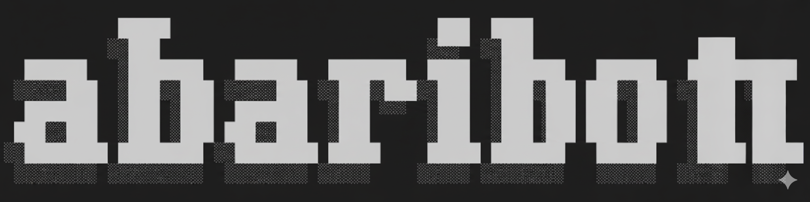

# abariBot

>An AI assistant for your documents and daily life.
 
Your AI assistant capable of answering questions about your documents and having conversations with you. It is built using state-of-the-art language models and vector databases. In long-term, it will be able to connect to various data sources such as Notion, Google Drive, and more. And it will able to do tech watch, market research, and more. It will be your personal AI assistant in your daily life and work. 

## Tech stack
- Language models: GPT-4, opensource Llama2, phi with ollama.
- Vector Database: Pinecode, opensource Faiss, chromaDB.
- Embedding models: OpenAI text-embedding-3-small00.
- Dababase: Supabase (PostgreSQL).
- Deployment: Docker, Vercel.
- Framework: Langchain, FastAPI, ReactJS
---

